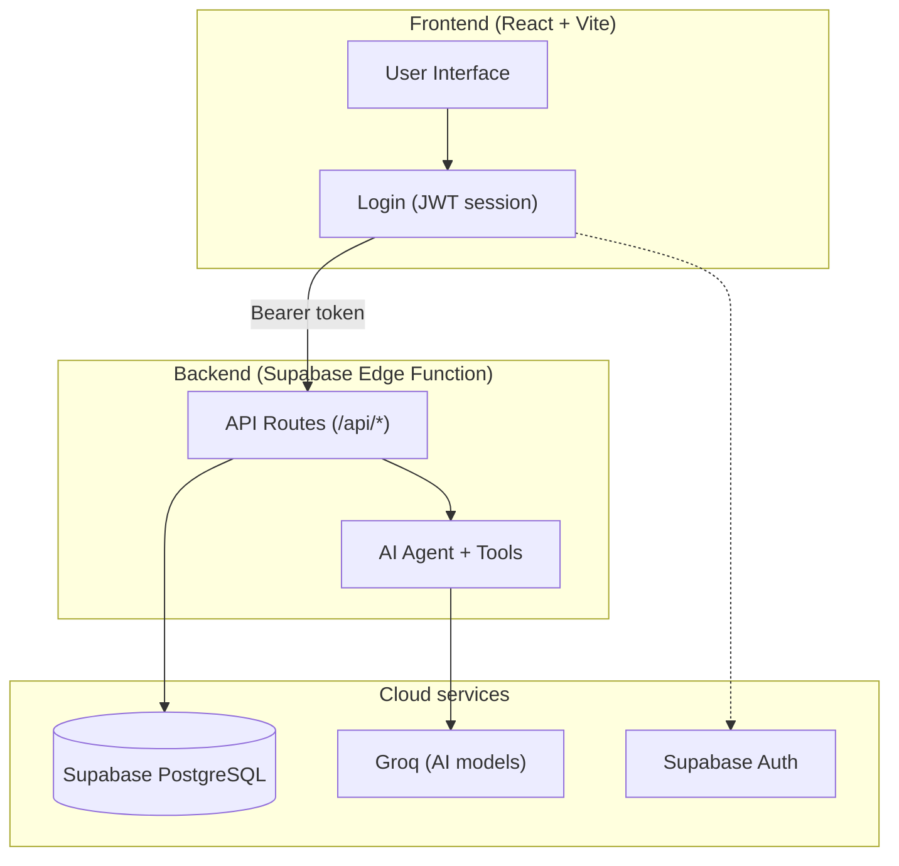

# Pragati (प्रगति)

<div align="center">


### Your personal AI teacher that makes sure you truly understand a topic — not just memorise it.

**Try it here**: [https://pragati-aadi.web.app](https://pragati-aadi.web.app)

</div>

---

Hi! Thanks for checking out my project. 🙂

**Pragati** means "progress" in Sanskrit. I built it because of a simple problem we all face while studying — we read something, feel like we understood it, and then forget it in two days. Pragati fixes this with a loop: **learn → get tested → find your weak spots → revise exactly those → repeat until you have fully mastered the topic.**

Think of it as a strict but friendly teacher who never lets a concept slip through the cracks.

---

## Table of Contents

- [What can Pragati do?](#what-can-pragati-do)
- [How it works (architecture)](#how-it-works-architecture)
- [Tech I used](#tech-i-used)
- [How I kept it secure](#how-i-kept-it-secure)
- [Run it on your machine](#run-it-on-your-machine)
- [Running the tests](#running-the-tests)
- [How to deploy it](#how-to-deploy-it)
- [For judges and recruiters](#for-judges-and-recruiters)
- [License](#license)

---

## What can Pragati do?

### 1. The mastery loop (the main idea)

This is the heart of the app:

1. **Learn any topic** — Talk to the AI teacher. It will not simply hand you the answer. It asks you questions, gives small hints, and builds your understanding step by step, from the basics.
2. **Take a test when you feel ready** — You decide when you are prepared. The AI makes a fresh test on exactly what you studied. You pick the difficulty (Beginner, Intermediate or Advanced) and the number of questions.
3. **Get hints during the test** — Stuck on a question? Ask for a hint. It nudges you in the right direction without spoiling the answer.
4. **See your weak spots** — While you attempt the test, Pragati quietly notes how long you took on each question, how many hints you used, and what you got wrong. From this it finds your exact weak concepts.
5. **Revise what you got wrong** — The "Questions to Review" page shows every question you missed or skipped. One click, and the AI teacher re-teaches you that exact concept.
6. **Repeat** — Take the test again, and keep going until you have mastered everything.

### 2. The AI teacher (chat)

- Guides you with questions instead of dumping answers.
- Answers stream in live, word by word, so you never stare at a blank screen.
- Handles math beautifully — all equations are properly typeset (you can write `$E = mc^2$` style math and it renders cleanly).
- You can click a photo of a question from your textbook or notebook, and the AI can read it (works well for handwritten equations and diagrams too).
- Changed your mind mid-answer? There is a stop button.
- Your chats are saved as named sessions, so you can come back to them anytime.

### 3. Quiz arena

- The AI creates a quiz on any topic you ask — for example "give me 10 questions on AC circuits, advanced level".
- Fair play is built in: the correct answer and explanation are removed on the server before the questions reach your browser. No cheating by opening the network tab. 🙂
- A question palette shows which questions you have attempted, skipped, or not visited yet.
- One click takes you from any quiz question straight into a teaching session about it.

### 4. Analytics

- Overall accuracy, average time per question, and total practice time.
- A progress curve that shows how you are improving over time.
- Topic-wise breakdown so you know which topics need more love.
- An Elo-style skill rating (like in chess) that goes up or down after every test, depending on the difficulty.

---

## How it works (architecture)

One important design decision: **the frontend never talks to the database or the AI directly.** Everything goes through a backend. This keeps all the secret keys safely on the server side.



In simple words:

1. You log in using Google or an email magic link (handled by Supabase Auth).
2. The app sends all its requests to the backend with your login token.
3. The backend checks your token, then talks to the database and the AI on your behalf.
4. The database has **Row Level Security** switched on — which means even inside the database, you can only ever see your own data.

---

## Tech I used

| Part | What it does | Built with |
| :--- | :--- | :--- |
| Frontend | The app you see and use | React 18, TypeScript, Vite, Tailwind CSS |
| Backend | The brain that handles all requests | Supabase Edge Function (Deno) |
| Database | Stores your quizzes, answers, progress | Supabase PostgreSQL |
| Login | Google sign-in and email magic links | Supabase Auth |
| AI | The teacher and quiz generator | Groq (fast AI inference) |
| Hosting | Where the app lives | Firebase Hosting |
| Math rendering | Pretty equations | KaTeX |
| Charts | Analytics graphs | Recharts |

---

## How I kept it secure

A few things I took care of (in plain words):

- **Your data is yours only.** Every table in the database has Row Level Security, so one user can never see another user's data — not even by writing their own API calls.
- **No secret keys in the browser.** The AI key and database keys live only on the backend. Only the public key (which is meant to be public) reaches the browser.
- **Rate limiting.** If someone tries to spam the AI with hundreds of requests, the backend slows them down. This also protects the free-tier AI quota.
- **No cheating in quizzes.** Correct answers and explanations are stripped out on the server before questions are sent to the browser.
- **Size limits on uploads.** So nobody can crash the server with a giant file.
- **Safe inputs.** Everything the user sends is checked and cleaned before use.

---

## Run it on your machine

### What you need first

- **Node.js** version 18 or above — download from [nodejs.org](https://nodejs.org/)
- A free **Supabase** account — [supabase.com](https://supabase.com/)
- A free **Groq** API key — [console.groq.com/keys](https://console.groq.com/keys)

### Step 1: Get the code

```bash
git clone https://github.com/aadisthunder/pragati.git
cd pragati
```

### Step 2: Set up the backend environment

Copy the sample file and fill in your keys:

```bash
cp server/.env.example server/.env
```

Now open `server/.env` and put in your own values:

```env
PORT=5000
NODE_ENV=development
SUPABASE_URL=https://<your-project>.supabase.co
SUPABASE_ANON_KEY=<your-supabase-anon-key>
GROQ_API_KEY=gsk_<your-groq-api-key>
```

You will find the Supabase URL and anon key in your Supabase dashboard under **Project Settings → API**.

### Step 3: Set up the frontend environment

```bash
cp client/.env.example client/.env
```

Then fill in `client/.env`:

```env
VITE_SUPABASE_URL=https://<your-project>.supabase.co
VITE_SUPABASE_ANON_KEY=<your-supabase-anon-key>
VITE_API_URL=
```

Leave `VITE_API_URL` empty — in local development the app automatically sends API calls to your local backend.

### Step 4: Create the database tables

Open your Supabase dashboard, go to the **SQL Editor**, paste the contents of [`supabase/schema.sql`](supabase/schema.sql) from this repo, and run it. This creates all the tables, security rules, and triggers in one go.

### Step 5: Install and run

```bash
# install everything (frontend + backend)
npm run install:all

# terminal 1 — start the backend
npm run dev:server

# terminal 2 — start the frontend
npm run dev:client
```

Now open [http://localhost:5173](http://localhost:5173) in your browser. That's it! 🎉

---

## Running the tests

The project has tests for the tricky parts — math rendering, quiz logic, AI input cleaning, and more:

```bash
npm test
```

Or run them separately:

```bash
cd server && npm test   # backend tests
cd client && npm test   # frontend tests
```

To check that a production build works:

```bash
npm run build
```

---

## How to deploy it

This app has two parts that get deployed separately: the **frontend** on Firebase, and the **backend** as a Supabase Edge Function. Both have free tiers.

### Part 1: Frontend on Firebase Hosting

1. Make a Firebase project at [console.firebase.google.com](https://console.firebase.google.com/) and note the project ID.
2. Log in and deploy:

```bash
firebase login
npm run build:client
firebase deploy --only hosting --project <your-firebase-project-id>
```

3. Before building, set your backend URL in `client/.env.production`:

```env
VITE_API_URL=https://<your-project>.supabase.co/functions/v1/api
```

This is important — without it the deployed site will look for the backend on your own computer.

### Part 2: Backend as a Supabase Edge Function

The backend code lives in `supabase/functions/api/`. Deploy it like this:

```bash
npm install -g supabase
supabase login
supabase functions deploy api --project-ref <your-supabase-project-ref>

# give the function its secret keys
supabase secrets set GROQ_API_KEY=gsk_your_key_here --project-ref <your-supabase-project-ref>
```

### Part 3: The Supabase login settings (do not skip!)

This one bit me during deployment, so learn from my mistake 🙂 — if you skip it, Google sign-in will silently redirect you to `localhost` instead of your live site.

In your Supabase dashboard, go to **Authentication → URL Configuration** and set:

- **Site URL**: `https://<your-firebase-project>.web.app`
- **Redirect URLs**: add `https://<your-firebase-project>.web.app/**` (you can also keep `http://localhost:5173/**` for local development)

If your `redirectTo` URL is not in this list, Supabase quietly falls back to the Site URL — that is why the Site URL must be your live address, not localhost.

### Part 4 (optional): Putting the backend on Render or Railway instead

If you prefer a normal Node.js server instead of an Edge Function, the `server/` folder is a standard Express app:

1. Create a new Web Service on [Render](https://render.com) or [Railway](https://railway.app).
2. Root directory: `server`, build command: `npm run build`, start command: `npm start`.
3. Add these environment variables: `SUPABASE_URL`, `SUPABASE_ANON_KEY`, `GROQ_API_KEY`, and `CLIENT_URL` / `CORS_ORIGIN` set to your frontend URL.
4. Then set `VITE_API_URL` to your Render/Railway URL and rebuild the frontend.

---

## For judges and recruiters

If you are evaluating this project (thank you!), there is no need to sign up:

1. Open [https://pragati-aadi.web.app](https://pragati-aadi.web.app)
2. On the login page, click **"Instant Judge Login"**

You will be logged in immediately with pre-loaded quiz history, telemetry data, and analytics — so you can see the full experience without an OTP or Google account. This account is **read-only** (protected by database rules), so exploring it can never spoil real student data.

---

## License

This project is open source under the [MIT License](LICENSE). Feel free to learn from it, fork it, and build your own thing. If it helped you, a star on the repo would make my day. ⭐
