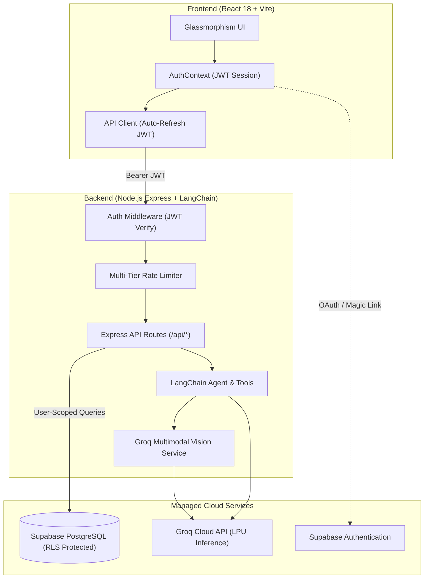

# Pragati (प्रगति)

<div align="center">


### Intelligent Socratic AI Learning Companion & Telemetry-Driven Assessment Arena

[](https://pragati-aadi.web.app)

[](https://nodejs.org/)
[](https://react.dev/)
[](https://www.typescriptlang.org/)
[](https://vitejs.dev/)
[](https://groq.com/)
[](https://supabase.com/)
[](https://firebase.google.com/)
[](https://tailwindcss.com/)
[](LICENSE)

*Built for STEM students, competitive exam aspirants, and curious minds who want to master concepts through first principles instead of memorizing flat answers.*

**Live Application**: [https://pragati-aadi.web.app](https://pragati-aadi.web.app)

</div>

---

## Table of Contents

- [Overview](#overview)
- [Live Demo](#live-demo)
- [Core Features](#core-features)
- [System Architecture (BFF Pattern)](#system-architecture-bff-pattern)
- [AI Engine & Capabilities](#ai-engine--capabilities)
- [Design System](#design-system)
- [Security & Production Hardening](#security--production-hardening)
- [Getting Started](#getting-started)
  - [Prerequisites](#prerequisites)
  - [Environment Setup](#environment-setup)
  - [Local Development](#local-development)
  - [Testing](#testing)
- [Deployment Guide](#deployment-guide)
- [Hackathon Demo Access](#hackathon-demo-access)
- [License](#license)

---

## Overview

**Pragati** (*Sanskrit for "Progress"*) is an AI-driven academic learning platform engineered around an active **Closed-Loop Mastery Framework**. Rather than simply explaining answers or acting like a passive chat bot, Pragati helps students deeply learn any topic or subtopic, challenge their understanding through adaptive testing, diagnose weak spots with cognitive telemetry, and systematically review and re-learn missed concepts until 100% mastery is achieved.

Pragati unites:
1. **Deep Socratic Learning**: Active conceptual exploration through first-principles questioning and step-by-step guidance.
2. **On-Demand Adaptive Testing**: Multi-level assessment generation triggered when the student feels ready, complete with in-quiz scaffolding and hints.
3. **Cognitive Telemetry**: Precision tracking of per-question dwell time, hint dependencies, and hesitation patterns.
4. **Targeted Review & Re-Teaching**: Dedicated remediation in the Analytics suite where the AI teaches the exact concepts behind incorrect answers in a continuous loop to mastery.

---

## Live Demo

The production application is live and accessible:

- **Web Application**: [https://pragati-aadi.web.app](https://pragati-aadi.web.app)
- **Recruiter / Evaluator Quick Access**: On the login screen, click **"Instant Judge Login"** to evaluate the platform immediately with pre-loaded telemetry data, quiz attempts, and analytics without needing an OTP or Google account.

---

## Core Features

### 1. The Closed-Loop Mastery System (Core Experience)
The defining feature of Pragati is its self-reinforcing mastery cycle that transforms passive studying into verified conceptual competence:
- **Deep Conceptual Study**: Engage with the AI to deeply learn any topic or granular subtopic through first-principles reasoning without being spoon-fed answers.
- **On-Demand Adaptive Testing**: Whenever a student feels they have grasped a topic sufficiently, the AI agent generates a comprehensive test tailored to those exact topics across selectable difficulty levels (Beginner, Intermediate, Advanced).
- **In-Test Scaffolding & Hints**: While testing, students can request contextual hints if stuck, nudging critical thinking without spoiling the answer.
- **Cognitive Telemetry & Weak-Spot Diagnostics**: As tests are submitted, Pragati records dwell time per question, hint consumption, and accuracy to pinpoint specific conceptual vulnerabilities.
- **Targeted "Questions to Review" Re-Teaching**: On the Analytics page, a dedicated **Questions to Review** hub compiles every missed or skipped question. With a single click, the AI instructor steps in to actively re-teach the underlying concepts.
- **Iterative Loop to True Mastery**: Students retake assessments and review weak concepts in an ongoing loop until every topic is fully mastered.

### 2. Socratic AI Instructor & Multimodal Capture
- **First-Principles Dialogue**: Guides students with targeted questions, scaffolding, and hints rather than dumping direct solutions.
- **Sub-Second Streaming**: Powered by Groq LPU hardware with Time-to-First-Token (TTFT) under 300ms.
- **Pristine KaTeX Math Rendering**: Flawless inline ($E = mc^2$) and block ($$\int_a^b f(x)\,dx$$) scientific typesetting.
- **Dynamic Tool Calling**: Uses LangChain tools to inspect quiz history, diagnose missed questions, and generate assessments on the fly.
- **Multimodal Problem Snapshot Capture**: Slide-up camera and photo gallery sheet allowing students to capture physical textbook problems, handwritten equations, or diagrams, with LaTeX OCR via Groq multimodal vision (`qwen/qwen3.6-27b`).
- **Single-Line Responsive Quick Chips**: Fast one-click prompt pills (*Ask a doubt*, *Request a quiz topic*, *Review performance*, *Review missed questions*) displayed in a clean single line on desktop and swipeable on mobile.

### 3. Interactive Quiz Arena
- **Dynamic Curriculum Generation**: AI crafts custom 3-to-10 question quizzes on any STEM topic with 4 choices, hints, and explanations.
- **Dual Telemetry Monospace HUD**: Real-time timer tracking per-question dwell time alongside overall exam countdown.
- **Immediate Socratic Remediation**: One-click transition from any missed question directly into a 1-on-1 tutoring session with the AI Instructor.

### 4. Telemetry-Driven Student Analytics
- **"Questions to Review" Hub**: Centralized review arena that lists all incorrect/skipped questions with one-click AI tutoring sessions.
- **Cognitive Metrics**: Dwell-time distribution, hint consumption velocity, and accuracy progression curves.
- **Topic Mastery Breakdown**: Visual progress bars categorizing student proficiency into Beginner, Intermediate, and Advanced tiers.
- **Adaptive Elo Rating**: Skill rating recalculation engine reflecting conceptual growth over time.

---

## System Architecture (BFF Pattern)

Pragati strictly adheres to the **Backend-for-Frontend (BFF)** architectural pattern. The frontend client **never** communicates directly with the database or external AI model providers.



---

## AI Engine & Capabilities

| Capability | Model | Provider / Hardware | Latency / Specs |
| :--- | :--- | :--- | :--- |
| **Socratic Reasoning & Tools** | `openai/gpt-oss-120b` | Groq LPU | ~250–350 tokens/sec, TTFT < 300ms |
| **Multimodal Problem Vision** | `qwen/qwen3.6-27b` | Groq LPU | ~800ms OCR extraction, LaTeX output |
| **Fast Fallback Engine** | `openai/gpt-oss-20b` | Groq LPU | ~500–800 tokens/sec |
| **Audio Transcription** | `whisper-large-v3-turbo` | Groq LPU | Near-instant voice transcription |

---

## Design System

Pragati features a **Minimalist Glassmorphism** visual language:
- **Palette**: Pristine white and subtle translucent panels (`backdrop-blur-md`, `border-slate-200/90`).
- **Typography**: 
  - **Headings**: Plus Jakarta Sans (bold, modern, tracking-tight).
  - **Body**: Inter (high-legibility reading experience).
  - **Numbers / Telemetry**: JetBrains Mono (precision exam countdown & timer).
- **Strict Iconography**: 100% **Lucide React** vector icons. **Zero emojis** anywhere in UI copy, buttons, badges, or headers.
- **Fixed Navigation**: Minimalist 3-item sidebar:
  1. `AI Instructor` (Interactive tutoring)
  2. `Quizzes` (Assessment arena)
  3. `Analytics` (Performance telemetry)

---

## Security & Production Hardening

- **User Data Isolation**: Every database interaction filters by the authenticated `user_id` and utilizes Supabase Row-Level Security (RLS).
- **Multi-Tier Rate Limiting**:
  - Global API limiter: `120 req/min`
  - AI Chat endpoint: `20 req/min` (safeguards Groq free-tier quotas)
  - Vision OCR upload: `8 req/min`
  - Quiz & Analytics endpoints: `80 req/min`
- **Payload Boundaries**: 100 KB global limit to prevent memory-exhaustion DoS; 5 MB limit restricted strictly to image uploads on `/api/instructor/chat`.
- **Security Headers**: `helmet()` enabled with secure content policies.
- **Zero Key Leakage**: Sensitive credentials (`GROQ_API_KEY`, `SUPABASE_SERVICE_ROLE_KEY`) reside solely on the backend. Only the public anon key is delivered to the browser.

---

## Getting Started

### Prerequisites
- **Node.js**: v18.0.0 or higher
- **npm** or **pnpm**
- **Supabase Account**: [supabase.com](https://supabase.com) (free project)
- **Groq API Key**: [console.groq.com](https://console.groq.com/keys)

### Environment Setup

1. **Clone the repository**:
   ```bash
   git clone https://github.com/your-username/pragati.git
   cd pragati
   ```

2. **Configure Backend Environment**:
   ```bash
   cp server/.env.example server/.env
   ```
   Edit `server/.env` and fill in your keys:
   ```env
   PORT=5000
   NODE_ENV=development
   SUPABASE_URL=https://<your-project>.supabase.co
   SUPABASE_ANON_KEY=<your-supabase-anon-key>
   GROQ_API_KEY=gsk_<your-groq-api-key>
   ```

3. **Configure Frontend Environment**:
   ```bash
   cp client/.env.example client/.env
   ```
   Edit `client/.env`:
   ```env
   VITE_SUPABASE_URL=https://<your-project>.supabase.co
   VITE_SUPABASE_ANON_KEY=<your-supabase-anon-key>
   ```

### Local Development

1. **Install dependencies**:
   ```bash
   npm run install:all
   ```

2. **Start Development Servers**:
   ```bash
   # Terminal 1: Start Backend (Express on http://localhost:5000)
   cd server && npm run dev

   # Terminal 2: Start Frontend (Vite on http://localhost:5173)
   cd client && npm run dev
   ```

3. Open `http://localhost:5173` in your browser.

### Testing

Pragati maintains comprehensive automated test coverage across both frontend and backend using **Vitest**:

```bash
# Run server test suite (Agent, Security, Rate Limiter, Vision OCR, Sanitizer)
cd server && npm test

# Run client test suite (Input Handlers, Image Compressor, Responsive Dock)
cd client && npm test
```

To verify production builds:
```bash
cd server && npm run build
cd client && npm run build
```

---

## Deployment Guide

### Production Setup (Firebase + Supabase)

#### 1. Frontend on Firebase Hosting (`pragati-aadi`)
1. Build the production bundle:
   ```bash
   cd client && npm run build
   ```
2. Deploy to Firebase:
   ```bash
   npx firebase-tools deploy --only hosting --project pragati-aadi
   ```
   Live at: `https://pragati-aadi.web.app`

#### 2. Backend on Supabase Edge Runtime
- The backend API is deployed as a secure Supabase Edge Function (`supabase/functions/api/index.ts`).
- All database queries, telemetry tracking, and AI tutoring requests are routed through the backend proxy with Supabase JWT authentication and Row Level Security (RLS).

### Alternative Deployment Options

#### Frontend (Vercel)
1. Import the repository in [Vercel](https://vercel.com).
2. Set **Root Directory** to `client`.
3. Framework Preset: **Vite**.
4. Configure Environment Variables:
   - `VITE_SUPABASE_URL`: `https://<your-project>.supabase.co`
   - `VITE_SUPABASE_ANON_KEY`: `<your-supabase-anon-key>`
   - `VITE_API_URL`: `https://<your-project>.supabase.co/functions/v1/api`
5. Deploy.

#### Backend (Render or Railway)
1. Create a new **Web Service** on [Render](https://render.com) or [Railway](https://railway.app).
2. Set **Root Directory** to `server`.
3. Build Command: `npm run build`
4. Start Command: `npm start` (executes `node dist/server.js`)
5. Configure Environment Variables:
   - `PORT`: `5000`
   - `NODE_ENV`: `production`
   - `SUPABASE_URL`: `https://<your-project>.supabase.co`
   - `SUPABASE_ANON_KEY`: `<your-supabase-anon-key>`
   - `GROQ_API_KEY`: `<your-groq-api-key>`
   - `CLIENT_URL`: `https://pragati-aadi.web.app`

### Supabase URL Configuration
In your Supabase project dashboard under **Authentication -> URL Configuration**:
- **Site URL**: `https://pragati-aadi.web.app`
- **Redirect URLs**: Add `https://pragati-aadi.web.app/**`

---

## Hackathon Demo Access

For hackathon judges and evaluators, Pragati includes a **One-Click Demo Access** feature:
- Navigate to the `/login` page.
- Click **"Instant Judge Login"** (or use `judge.pragati@gmail.com`).
- You will be authenticated immediately with pre-loaded telemetry data and quiz history.

---

## License

This project is open source and available under the [MIT License](LICENSE).
