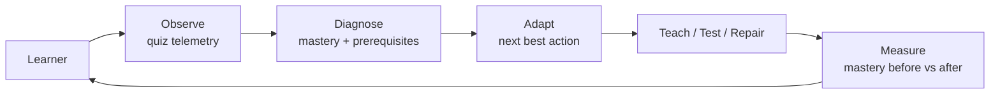
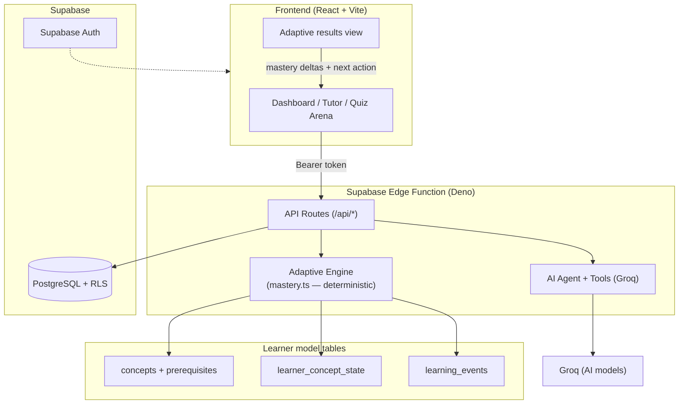

# Pragati (प्रगति) — The AI Tutor That Learns How You Learn

<div align="center">


**Try it here**: [https://pragati-aadi.web.app](https://pragati-aadi.web.app) — or click **"Try the Adaptive Demo"** on the login page.

</div>

---

## Most AI tutors answer questions. Pragati measures whether you actually learned.

Ask ChatGPT to explain derivatives and you'll get a good explanation. But it has no idea whether you can *use* them — and it never finds out.

Pragati closes that loop. It builds a **learner model** from your answers, response time, hints, and skipped questions. It finds the concept — and the *prerequisite* concept — that's actually blocking you. Then it chooses the next best learning action, teaches, retests, and **measures whether the intervention worked**.

### The core loop


```mermaid
graph LR
    A[Learner] --> B[Observe<br/>quiz telemetry]
    B --> C[Diagnose<br/>mastery + prerequisites]
    C --> D[Adapt<br/>next best action]
    D --> E[Teach / Test / Repair]
    E --> F[Measure<br/>mastery before vs after]
    F --> A
```

### Why Pragati is different

| | Typical AI tutor | Pragati |
| :--- | :--- | :--- |
| Optimizes for | a good response | **demonstrated mastery** |
| Knows what you know | nothing | per-concept mastery with confidence |
| When you fail | repeats the same lesson | finds the **root-cause prerequisite** and repairs it |
| Difficulty | whatever you clicked | adapts automatically, with a stated reason |
| Proof | none | measurable before → after mastery deltas |

---

## The Adaptive Agent (the core idea)

Pragati's decision core is a **deterministic rule engine** — not another prompt. The same learner evidence always produces the same decision, which makes it testable, evaluable, and impossible for the demo to fail. The LLM generates *content* (lessons, quizzes); it never decides *pedagogy*.

On every quiz submit, the engine:

1. **Updates mastery** per concept from weighted evidence (correctness × response time × hints × skips), with evidence damping and an uncertainty cap for new learners.
2. **Diagnoses prerequisites** — walks the concept graph upward from a failed concept to find the weakest *root cause* (e.g., "your derivative procedure is failing because **power rule** is at 32%").
3. **Chooses the next action**: `TEACH_NEW`, `SOCRATIC`, `MICRO_QUIZ`, `RETEACH`, `PREREQUISITE_REPAIR`, `SPACED_REVIEW`, or `CHALLENGE` — with a difficulty level and a one-sentence **"Why this next?"** rationale (no hidden chain-of-thought).
4. **Schedules spaced review** based on demonstrated retention (1 → 2 → 5 → 10 → 21 day bands).
5. **Emits a visible agent trace** — structured events only, so you can watch the agent think:

```text
✓ Observation recorded (2/5 correct)
✓ Concept mastery updated from quiz evidence
⚠ Prerequisite weakness detected: Power Rule
→ Selected prerequisite repair
→ Next: restore Power Rule above 70%, then retest derivative application
```

After the diagnostic quiz in the demo, the results screen shows mastery bars moving **before → after** per concept, the chosen next action with its rationale, and the full trace.

---

## Measured adaptation accuracy

All metrics below are produced by the deterministic evaluation harness
(`server/src/__tests__/masteryEvaluation.test.ts`) — **run `npm --prefix server test` to reproduce them.** No number on this page is invented.

```text
Scenarios: 30        Adaptation accuracy: 100%

hidden prerequisite   4/4     repeated failure   2/2     repeated success  2/2
slow correct          1/1     fast correct       2/2     hint dependency   2/2
spaced review         3/3     obvious weakness   2/2     difficulty adap.  5/5
```

The harness covers the cases that matter: hidden prerequisite failures, hint-reliant "high scorers" who haven't actually mastered anything, slow-but-correct fluency gaps, and difficulty transitions.

---

## What else is in the box

- **Socratic AI tutor** — guides with questions instead of dumping answers; streams live; handles LaTeX math and photos of handwritten problems (OCR).
- **Goal-driven learning memory** — on first login Pragati asks what you want to master, generates a subtopic plan, and remembers it: the tutor weaves your goals into every chat (and offers a test when the conversation touches one), while the Topics page tracks a live mastery percentage per topic and subtopic from real quiz evidence.
- **Quiz arena** — AI-generated quizzes on any topic, hints during the test, question palette, per-question telemetry captured client-side.
- **Anti-cheating by design** — correct answers and explanations are stripped on the server before questions reach the browser.
- **Analytics** — concept mastery map, topic breakdowns, accuracy progression curve, Elo-style skill rating, due-review counts.
- **Judge Mode** — seeded, deterministic demo (below).

---

## Architecture

One important design decision: **the frontend never talks to the database or the AI directly.** Everything goes through the backend. The adaptive engine is a pure TypeScript module shared by the Edge Function and the test suite.


```mermaid
graph TD
    subgraph Client ["Frontend (React + Vite)"]
        UI["Dashboard / Tutor / Quiz Arena"]
        Results["Adaptive results view"]
    end

    subgraph Edge ["Supabase Edge Function (Deno)"]
        Router["API Routes (/api/*)"]
        Agent["AI Agent + Tools (Groq)"]
        Adapt["Adaptive Engine<br/>(mastery.ts — deterministic)"]
    end

    subgraph Data ["Supabase"]
        DB[("PostgreSQL + RLS")]
        Auth["Supabase Auth"]
    end

    subgraph Model ["Learner model tables"]
        C["concepts + prerequisites"]
        L["learner_concept_state"]
        E["learning_events"]
    end

    UI -->|"Bearer token"| Router
    Router --> Agent
    Agent --> Groq["Groq (AI models)"]
    Router --> Adapt
    Adapt --> C & L & E
    Router --> DB
    Results -->|"mastery deltas + next action"| UI
    Auth -.-> Client
```

**Learner model schema:** `concepts` → `concept_prerequisites` (the graph) → `question_concepts` (tagging) → `learner_concept_state` (mastery, confidence, attempts, response time, next review) → `learning_events` (every mastery transition, so interventions can be evaluated).

**Security model:** every table has Row-Level Security scoped to `auth.uid()`; the learner-state tables follow the same owner-only pattern. The service role is used *only* to upsert shared reference data (the concept taxonomy), never learner data.

---

## For judges and recruiters

If you are evaluating this project (thank you!), there is no need to sign up:

1. Open [https://pragati-aadi.web.app](https://pragati-aadi.web.app)
2. Click **"Try the Adaptive Demo"** — you land directly in a seeded diagnostic quiz with a learner profile that already has gaps (Functions 88% · Power Rule 32% · Derivatives 47%).

**The 90-second tour:** take the quiz (guessing wrong on derivative questions is fine — the engine needs the evidence) → watch concept mastery update on the results screen → see the engine diagnose the weak *prerequisite* and choose **prerequisite repair** → follow "Do it now with AI" into the targeted micro-lesson → check the Concept Mastery Map in Analytics.

There is also a read-only **"Instant Judge Login"** with pre-loaded quiz history and analytics. The adaptive demo account is writable (so the engine can respond to *your* answers); it contains only disposable seed data. Every evaluation number in this README is reproducible from the test suite — see [`docs/AI_DISCLOSURE.md`](docs/AI_DISCLOSURE.md) for how AI tools were used in building this.

---

## Run it on your machine

### What you need first

- **Node.js** version 18 or above — download from [nodejs.org](https://nodejs.org/)
- A free **Supabase** account — [supabase.com](https://supabase.com/)
- A free **Groq** API key — [console.groq.com/keys](https://console.groq.com/keys)

### Step 1: Get the code

```bash
git clone https://github.com/aadisthunder/pragati.git
cd pragati
```

### Step 2: Set up the backend environment

Copy the sample file and fill in your keys:

```bash
cp server/.env.example server/.env
```

Now open `server/.env` and put in your own values:

```env
PORT=5000
NODE_ENV=development
SUPABASE_URL=https://<your-project>.supabase.co
SUPABASE_ANON_KEY=<your-supabase-anon-key>
GROQ_API_KEY=gsk_<your-groq-api-key>
```

You will find the Supabase URL and anon key in your Supabase dashboard under **Project Settings → API**.

### Step 3: Set up the frontend environment

```bash
cp client/.env.example client/.env
```

Then fill in `client/.env`:

```env
VITE_SUPABASE_URL=https://<your-project>.supabase.co
VITE_SUPABASE_ANON_KEY=<your-supabase-anon-key>
VITE_API_URL=
```

Leave `VITE_API_URL` empty — in local development the app automatically sends API calls to your local backend.

### Step 4: Create the database tables

Open your Supabase dashboard, go to the **SQL Editor**, paste the contents of [`supabase/schema.sql`](supabase/schema.sql) from this repo, and run it. This creates all the tables, security rules, and triggers in one go.

To seed the judge demo (writable demo account + Calculus concept graph + the deterministic diagnostic quiz), also run [`supabase/seed/judge-demo.sql`](supabase/seed/judge-demo.sql).

### Step 5: Install and run

```bash
# install everything (frontend + backend)
npm run install:all

# terminal 1 — start the backend
npm run dev:server

# terminal 2 — start the frontend
npm run dev:client
```

Now open [http://localhost:5173](http://localhost:5173) in your browser. That's it!

---

## Running the tests

The project has comprehensive test coverage across the entire stack — 338 automated tests (238 backend + 100 frontend) covering the adaptive decision core, the 30-scenario evaluation harness, quiz telemetry, CORS security, token budgeting, math rendering, and cache invalidation:

```bash
npm test
```

Or run them separately:

```bash
cd server && npm test   # backend + adaptive-engine + evaluation tests (238 tests)
cd client && npm test   # frontend tests (100 tests)
```

The evaluation summary prints the measured adaptation metrics shown above (30/30 scenarios, 100% adaptation accuracy).

To check that a production build works:

```bash
npm run build
```

---

## How to deploy it

This app has two parts that get deployed separately: the **frontend** on Firebase, and the **backend** as a Supabase Edge Function. Both have free tiers.

### Part 1: Frontend on Firebase Hosting

1. Make a Firebase project at [console.firebase.google.com](https://console.firebase.google.com/) and note the project ID.
2. Log in and deploy:

```bash
firebase login
npm run build:client
firebase deploy --only hosting --project <your-firebase-project-id>
```

3. Before building, set your backend URL in `client/.env.production`:

```env
VITE_API_URL=https://<your-project>.supabase.co/functions/v1/api
```

This is important — without it the deployed site will look for the backend on your own computer.

### Part 2: Backend as a Supabase Edge Function

The backend code lives in `supabase/functions/api/`. Deploy it like this:

```bash
npm install -g supabase
supabase login
supabase functions deploy api --project-ref <your-supabase-project-ref>

# give the function its secret keys
supabase secrets set GROQ_API_KEY=gsk_your_key_here --project-ref <your-supabase-project-ref>
supabase secrets set SUPABASE_SERVICE_ROLE_KEY=your_service_role_key --project-ref <your-supabase-project-ref>
```

(`SUPABASE_SERVICE_ROLE_KEY` is optional but recommended — the Edge Function uses it only to upsert the shared concept taxonomy; without it the app still works and falls back to keyword-based concept matching.)

### Part 3: The Supabase login settings (do not skip!)

This one bit me during deployment, so learn from my mistake — if you skip it, Google sign-in will silently redirect you to `localhost` instead of your live site.

In your Supabase dashboard, go to **Authentication → URL Configuration** and set:

- **Site URL**: `https://<your-firebase-project>.web.app`
- **Redirect URLs**: add `https://<your-firebase-project>.web.app/**` (you can also keep `http://localhost:5173/**` for local development)

If your `redirectTo` URL is not in this list, Supabase quietly falls back to the Site URL — that is why the Site URL must be your live address, not localhost.

### Part 4 (optional): Putting the backend on Render or Railway instead

If you prefer a normal Node.js server instead of an Edge Function, the `server/` folder is a standard Express app:

1. Create a new Web Service on [Render](https://render.com) or [Railway](https://railway.app).
2. Root directory: `server`, build command: `npm run build`, start command: `npm start`.
3. Add these environment variables: `SUPABASE_URL`, `SUPABASE_ANON_KEY`, `GROQ_API_KEY`, and `CLIENT_URL` / `CORS_ORIGIN` set to your frontend URL.
4. Then set `VITE_API_URL` to your Render/Railway URL and rebuild the frontend.

---

## How I kept it secure

A few things I took care of (in plain words):

- **Your data is yours only.** Every table in the database has Row Level Security, so one user can never see another user's data — not even by writing their own API calls. The new learner-model tables follow the same owner-only pattern.
- **No secret keys in the browser.** The AI key and database keys live only on the backend. Only the public key (which is meant to be public) reaches the browser.
- **Rate limiting & 8K TPM token budget protection.** If someone tries to spam the AI with hundreds of requests, the backend slows them down. For Groq reasoning models like `openai/gpt-oss-120b` with an 8,000 token-per-minute cap, Pragati dynamically shrinks context (pruning older turns and truncating bulky inputs) and honors `retry-after` backoff so students never face a 429 error card.
- **Secure CORS allowlisting.** Local development ports (Vite 5173, 5174, etc.) and production domains (`*.web.app`, `*.firebaseapp.com`, `*.vercel.app`) are strictly validated.
- **No cheating in quizzes.** Correct answers and explanations are stripped out on the server before questions are sent to the browser.
- **Size limits on uploads.** So nobody can crash the server with a giant file.
- **Safe inputs.** Everything the user sends is checked and cleaned before use.
- **A honest demo account.** The writable adaptive-demo account contains only disposable seed data, and the read-only judge account is locked down by database policies.


---

## Tech I used

| Part | What it does | Built with |
| :--- | :--- | :--- |
| Frontend | The app you see and use | React 18, TypeScript, Vite, Tailwind CSS |
| Backend | The brain that handles all requests | Supabase Edge Function (Deno) |
| Adaptive engine | The deterministic decision core | Pure TypeScript (shared by backend + tests) |
| Database | Stores your quizzes, answers, progress, learner model | Supabase PostgreSQL |
| Login | Google sign-in and email magic links | Supabase Auth |
| AI | The teacher and quiz generator | Groq (fast AI inference) |
| Hosting | Where the app lives | Firebase Hosting |
| Math rendering | Pretty equations | KaTeX |
| Charts | Analytics graphs | Recharts |
| Testing | Decision-core + evaluation harness + app logic | Vitest, Supertest |

---

## License

This project is open source under the [MIT License](LICENSE). Feel free to learn from it, fork it, and build your own thing. If it helped you, a star on the repo would make my day.
