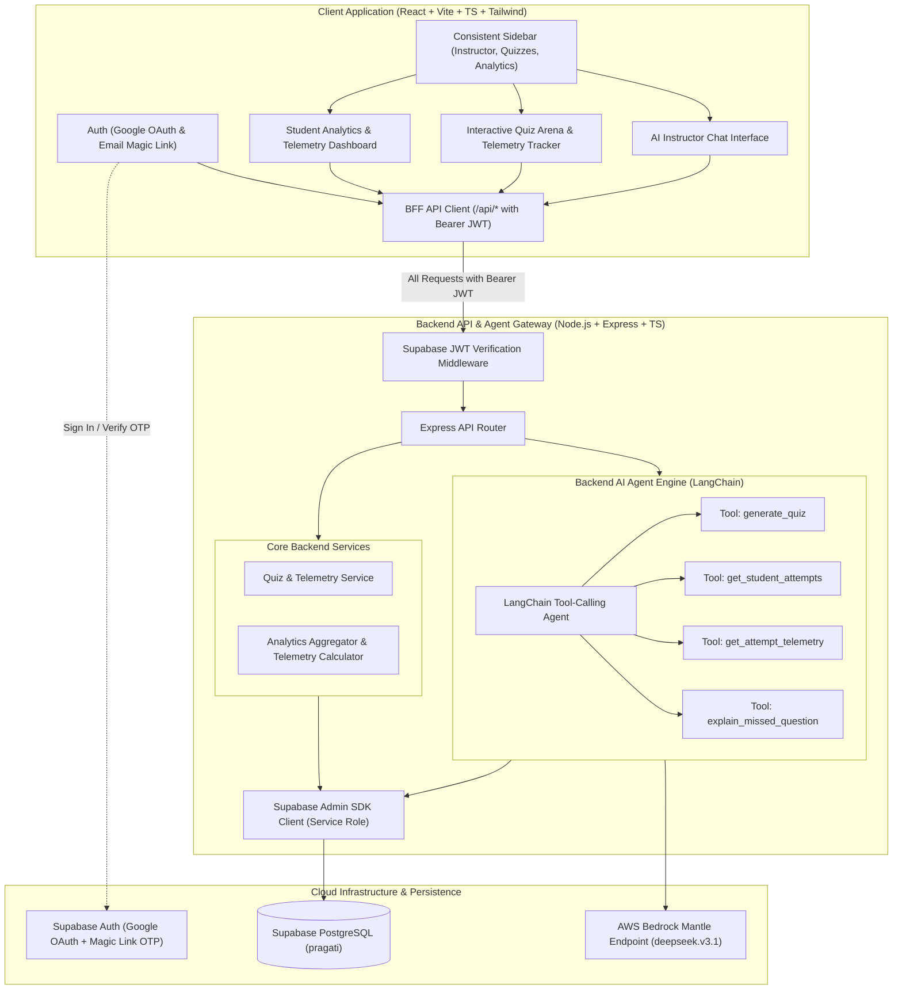
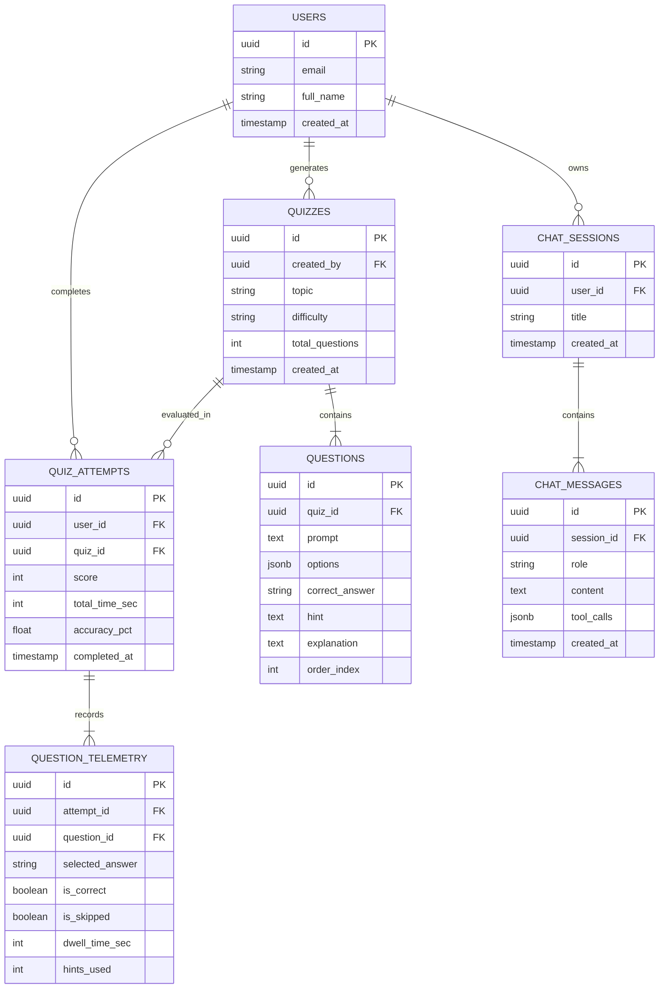

# Pragati - System Architecture & Technical Specifications
*Client-Server Architecture • Backend LangChain Agent • Supabase Infrastructure • Bedrock Mantle LLM*

---

## 1. Architectural Model & Security Boundaries (Strict BFF Pattern)

Pragati is architected with a strict **Backend-for-Frontend (BFF)** pattern.
**The frontend client NEVER interacts directly with the database or third-party AI models.**



---

## 2. Authentication & Data Isolation

1. **Authentication Providers**:
   - **Google OAuth**: One-click authentication with Google.
   - **Passwordless Email Magic Link**: Users enter email and receive a secure OTP / magic link. Zero password storage or leaks.
2. **Protected Routes**:
   - Every application route (`/instructor`, `/quizzes`, `/analytics`) is wrapped with `ProtectedRoute`.
   - Unauthenticated visitors are redirected to `/login`.
3. **Strict User Data Isolation**:
   - The backend `authMiddleware` verifies the Supabase access token on every request.
   - The decoded `user.id` is injected into `req.user`.
   - All database queries filter strictly by `user_id = req.user.id`.

---

## 3. Backend AI Agent (LangChain + Bedrock Mantle)

The AI Instructor is an autonomous **LangChain Tool-Calling Agent** running inside the Node.js backend.

### Model Configuration
- **Endpoint**: `https://bedrock-mantle.us-east-1.api.aws/v1`
- **Authentication**: `process.env.AWS_BEDROCK_MANTLE`
- **Default Model**: `deepseek.v3.1` (sub-400ms ultra-fast inference and strong reasoning) with fallback to `zai.glm-4.7` or `mistral.mistral-large-3-675b-instruct`.

### Dedicated Agent Tools
1. **`generate_quiz(topic, difficulty, num_questions)`**:
   - Dynamically constructs a pedagogical assessment with multiple choice questions, options, hints, and explanations.
   - Inserts the generated quiz and questions into Supabase.
   - Returns the created quiz ID and summary for the student.
2. **`get_student_attempts()`**:
   - Fetches the current student's quiz history, scores, and dates.
3. **`get_attempt_telemetry(attempt_id)`**:
   - Retrieves granular performance metrics: dwell time per question, hints requested, and identifies questions the student missed or skipped.
4. **`explain_missed_question(question_id)`**:
   - Fetches the missed question prompt, the student's incorrect selection, and the correct rationale to deliver targeted Socratic remediation.

---

## 4. Database Schema (Supabase PostgreSQL: `rraemkgnxfrcdjfvpiml`)



---

## 5. Technology Stack & Project Structure

### Frontend (`client/`)
- **Framework**: React 18+ (Vite)
- **Language**: TypeScript
- **Styling**: Tailwind CSS with Glassmorphism tokens (`bg-white/80 backdrop-blur-md border border-slate-200/80 shadow-sm`)
- **Icons**: `lucide-react` (Strictly NO emojis)
- **Math & Markdown**: `react-markdown`, `remark-math`, `rehype-katex`
- **Charts**: Recharts (clean 2D lines & bar graphs)

### Backend (`server/`)
- **Runtime**: Node.js
- **Framework**: Express.js with TypeScript
- **AI Agent**: LangChain (`@langchain/core`, `@langchain/openai`)
- **Database Client**: `@supabase/supabase-js` (Service Role for admin queries)
- **Validation**: Zod schema parsing

### Root Layout
```text
pragati/
├── client/                     # Vite + React 18 + TS Frontend
│   ├── src/
│   │   ├── api/                # API client with Supabase JWT
│   │   ├── components/
│   │   │   ├── layout/         # Glassmorphism AppShell & Fixed Sidebar
│   │   │   ├── auth/           # Google OAuth & Email Magic Link forms
│   │   │   ├── instructor/     # LangChain Agent Chat UI & Tool visualizers
│   │   │   ├── quiz/           # Quiz Arena, dual timers, hint reveal
│   │   │   └── analytics/      # Telemetry scorecards, dwell time breakdown
│   │   ├── context/            # AuthContext, AppContext
│   │   ├── App.tsx
│   │   └── main.tsx
├── server/                     # Express + TypeScript Backend
│   ├── src/
│   │   ├── agent/              # LangChain Agent & Tools (quiz gen, telemetry)
│   │   ├── middleware/         # authMiddleware (Supabase JWT verification)
│   │   ├── routes/             # /api/instructor, /api/quizzes, /api/analytics
│   │   ├── db/                 # Supabase client & migration scripts
│   │   └── server.ts
├── rules.md                    # Project Engineering Rules
├── GEMINI.md                   # Antigravity Workspace Directives
├── architecture.md             # System Architecture & Contracts
├── design.md                   # Minimalist Glassmorphism UI Guidelines
└── .env                        # Bedrock Mantle & Supabase Credentials
```
