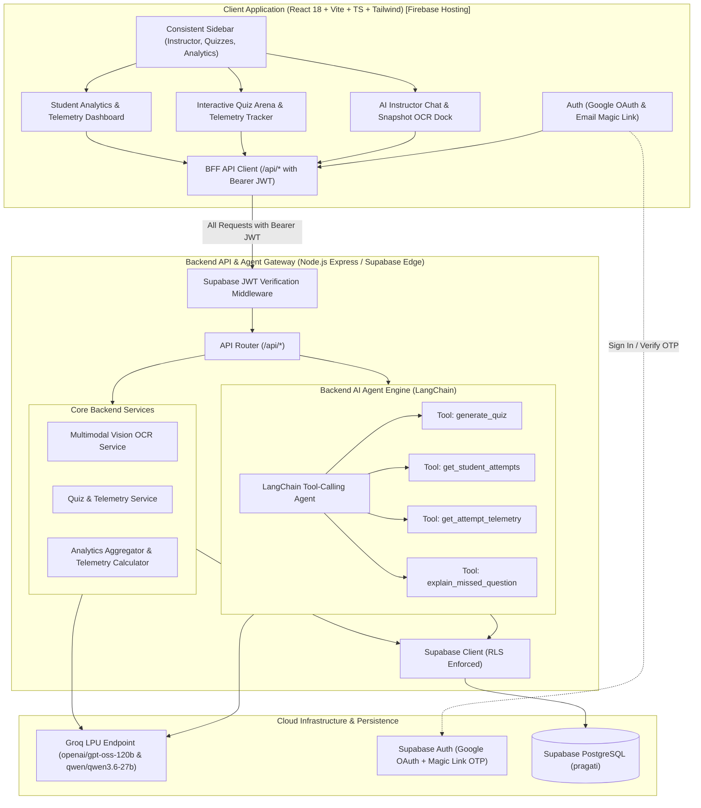
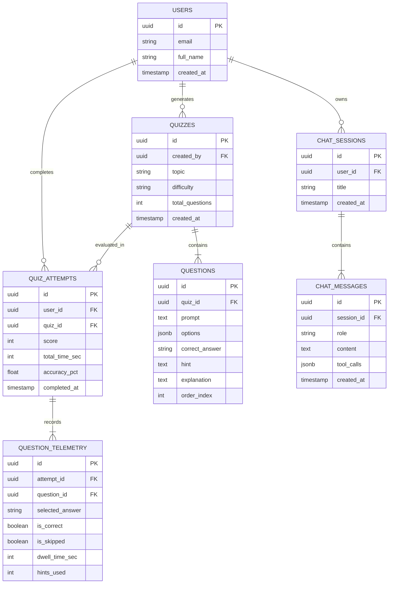

# Pragati - System Architecture & Technical Specifications
*Client-Server Architecture • Backend LangChain Agent • Supabase Infrastructure & Edge Runtime • Groq LPU Inference*

---

## 1. Architectural Model & Security Boundaries (Strict BFF Pattern)

Pragati is architected with a strict **Backend-for-Frontend (BFF)** pattern.
**The frontend client NEVER interacts directly with the database or third-party AI models.**



---

## 2. Authentication & Data Isolation

1. **Authentication Providers**:
   - **Google OAuth**: One-click authentication with Google.
   - **Passwordless Email Magic Link**: Users enter email and receive a secure OTP / magic link. Zero password storage or leaks.
2. **Protected Routes**:
   - Every application route (`/instructor`, `/quizzes`, `/analytics`) is wrapped with `ProtectedRoute`.
   - Unauthenticated visitors are redirected to `/login`.
3. **Strict User Data Isolation**:
   - The backend `authMiddleware` verifies the Supabase access token on every request via `supabase.auth.getUser(token)`.
   - The decoded `user.id` is injected into `req.user`.
   - All database queries filter strictly by `user_id = req.user.id`, backed by database-level Row Level Security (RLS).

---

## 3. Backend AI Agent & Multimodal Vision (LangChain + Groq LPU)

The AI Instructor is an autonomous **LangChain Tool-Calling Agent** running inside the backend.

### Model Configuration
- **Endpoint**: `https://api.groq.com/openai/v1`
- **Authentication**: `process.env.GROQ_API_KEY`
- **Default Reasoning Model**: `openai/gpt-oss-120b` (sub-300ms ultra-fast inference and strong Socratic reasoning on Groq LPU hardware) with fallback to `llama-3.3-70b-versatile`.
- **Multimodal Vision Model**: `qwen/qwen3.6-27b` for textbook problem OCR and diagram mathematical reasoning.

### Dedicated Agent Tools
1. **`generate_quiz(topic, difficulty, num_questions)`**:
   - Dynamically constructs a pedagogical assessment with multiple choice questions, options, hints, and explanations.
   - Inserts the generated quiz and questions into Supabase.
   - Returns the created quiz ID and summary for the student.
2. **`get_student_attempts()`**:
   - Fetches the current student's quiz history, scores, and dates.
3. **`get_attempt_telemetry(attempt_id)`**:
   - Retrieves granular performance metrics: dwell time per question, hints requested, and identifies questions the student missed or skipped.
4. **`explain_missed_question(question_id)`**:
   - Fetches the missed question prompt, the student's incorrect selection, and the correct rationale to deliver targeted Socratic remediation.

### Multimodal Vision Pipeline
1. Student captures physical textbook problem or uploads diagram via the snapshot camera dock.
2. Client compresses image below 1MB to prevent bandwidth exhaustion.
3. Backend passes base64 payload to Groq's high-speed multimodal vision model (`qwen/qwen3.6-27b`).
4. Extracted mathematical expressions and LaTeX are fed into the Socratic AI Instructor prompt for step-by-step guidance.

---

## 4. Database Schema (Supabase PostgreSQL: `rraemkgnxfrcdjfvpiml`)



---

## 5. Technology Stack & Production Architecture

### Frontend (`client/`)
- **Hosting**: Firebase Hosting (`pragati-aadi.web.app`)
- **Framework**: React 18+ (Vite)
- **Language**: TypeScript
- **Styling**: Tailwind CSS with Glassmorphism tokens (`bg-white/80 backdrop-blur-md border border-slate-200/80 shadow-sm`)
- **Icons**: `lucide-react` (Strictly NO emojis)
- **Math & Markdown**: `react-markdown`, `remark-math`, `rehype-katex`
- **Charts**: Recharts (clean 2D lines & bar graphs)

### Backend API & Runtimes
- **Production Serverless**: Supabase Edge Functions (`supabase/functions/api/index.ts`) on Deno runtime with CORS whitelist locking.
- **Dedicated Container Runtime**: Node.js Express server (`server/src/server.ts`) for local development and containerized deployments.
- **AI Agent Engine**: LangChain (`@langchain/core`, `@langchain/openai`) powered by Groq LPU hardware.
- **Database & Auth**: `@supabase/supabase-js` with Row Level Security (RLS) on PostgreSQL 17.
- **Validation**: Zod schema parsing.

### Repository Layout
```text
pragati/
├── client/                     # Vite + React 18 + TS Frontend
│   ├── src/
│   │   ├── api/                # API client with Supabase JWT & SWR cache
│   │   ├── components/
│   │   │   ├── layout/         # Glassmorphism AppShell & Fixed Sidebar
│   │   │   ├── auth/           # Google OAuth & Email Magic Link forms
│   │   │   ├── chat/           # TypewriterMessage & Chat Bubble components
│   │   │   └── ...
│   │   ├── pages/              # InstructorPage, QuizzesPage, AnalyticsPage, LoginPage
│   │   ├── context/            # AuthContext
│   │   ├── App.tsx
│   │   └── main.tsx
├── server/                     # Express + TypeScript Backend
│   ├── src/
│   │   ├── agent/              # LangChain Agent & Tools (quiz gen, telemetry)
│   │   ├── middleware/         # authMiddleware & rateLimiter
│   │   ├── routes/             # /api/instructor, /api/quizzes, /api/analytics, /api/auth
│   │   ├── services/           # visionService & analyticsService
│   │   ├── config/             # Supabase client initialization
│   │   └── server.ts
├── supabase/
│   └── functions/
│       └── api/                # Deployed Supabase Edge Function
├── firebase.json               # Firebase Hosting configuration
├── .firebaserc                 # Firebase default project alias
├── docs/
│   ├── architecture.md         # System Architecture & Technical Specifications
│   └── design.md               # Minimalist Glassmorphism UI Guidelines
└── README.md                   # Project Overview & Live Access Showcase
```
